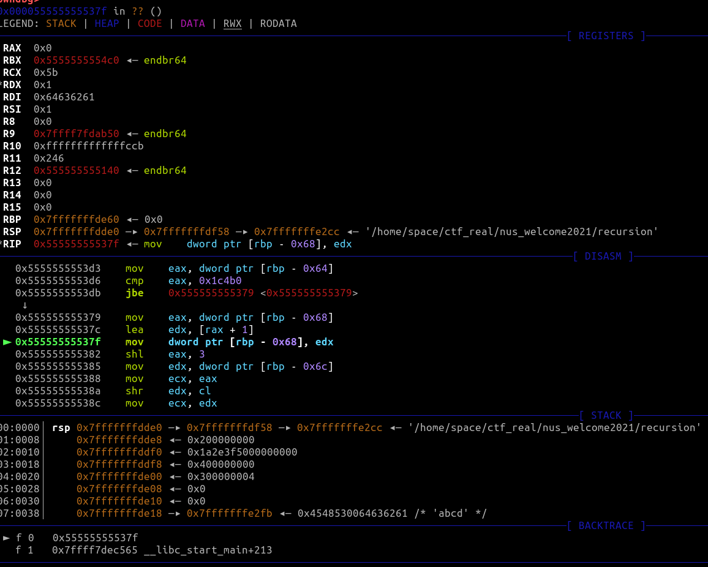

# Recursion

We jump right into the target binary. Following the call to `__libc_start_main` in near the entry point,
we get to this part in the code, which decompiles (I was using Ghidra to reverse) to this:
```c
// these were untyped, but we know this is main's signature because it ...is
int main(int argc,char **argv) {
    /* some variables are declared */
    int iVar1;
    long lVar2;
    char *__s;
    int returnValue;
    size_t x;
    int *piVar3;
    ssize_t sVar4;
    long in_FS_OFFSET;
    uint p1f4Packed;
    int local_70;
    uint i;
    long local_60;
    size_t local_58;
    char *local_40;
    char *local_38;
    char *local_30;
    undefined8 local_28;
    char p1FirstFour [4];

    if (argc == 2) {
    x = strlen(argv[1]);
    if ((x & 3) == 0) {
      __s = argv[1];
      p1FirstFour = 0;
      x = strlen(__s);
      if (x < 4) {
        x = strlen(__s);
        returnValue = (int)x;
      }
      else {
        returnValue = 4;
      }
      memcpy(p1FirstFour,__s,(long)returnValue);
      returnValue = memfd_create(p1FirstFour,1);
      if (returnValue < 0) {
        piVar3 = __errno_location();
        returnValue = *piVar3;
      }
    }
    /* ... */
```

(Note: Some of the variables may have been renamed and retyped while I was working on it.)

Now, looking carefully through the code, we notice that it first checks if it recieved exactly
one command-line argument. Then, if it is, it copies the first 4 bytes of the argument into another string.
It then sets up an anonymous file for later use.

Then it initializes some sort of seed value with these first 4 bytes...

```c
        else {
        p1f4Packed = (int)p1FirstFour[0] |
                     (int)p1FirstFour[3] << 0x18 | (int)p1FirstFour[2] << 0x10 |
                     (int)p1FirstFour[1] << 8;
```
then it enters some form of loop, where it seems to be XORing some data in the program with
data generated by using the seed value. 

```c
        local_70 = 0;
        for (i = 0; i < 0x1c4b1; i = i + 1) {
            ivar1 = local_70 + 1;
            array_00104020[(int)i] =
                (byte)(p1f4packed >> ((byte)(local_70 << 3) & 0x1f)) ^ array_00104020[(int)i];
            local_70 = ivar1;
            if (ivar1 == 4) {
            p1f4packed = fun_00101229();
            local_70 = 0;
            }
        }
```

Then it writes the modified program data to the anonymous file...

```c
        local_60 = 0;
        local_58 = 0x1c4b1;
        do {
          sVar4 = write(returnValue,ARRAY_00104020 + local_60,local_58);
          if (sVar4 == -1) {
            piVar3 = __errno_location();
            if (*piVar3 != 4) {
              piVar3 = __errno_location();
              returnValue = *piVar3;
              goto LAB_0010149c;
            }
          }
          else {
            local_60 = local_60 + sVar4;
            local_58 = local_58 - sVar4;
          }
        } while ((long)local_58 < 0);
```

...then it calls `fexecve` on the anonymous file, which runs whatever was stored there.

```c
        local_38 = "";
        local_30 = argv[1] + 4;
        local_28 = 0;
        local_40 = (char *)0x0;
        returnValue = fexecve(returnValue,&local_38,&local_40);
```

Let's look at the generation in detail: it seems to be recomputing this seed
value every 4 iterations, using some sort of function.
it XORs a byte of program data with some bytes of the seed value. On the 0th (and fourth, and eighth,
and twelfth, etc) iterations, it XORs the last 8 bytes, then on the 1st, the next 8, then on the
2nd, the next 8, et cetera.


Let's go reverse the function:
```c
long FUN_00101229(uint param_1)
{
  return (ulong)param_1 * (ulong)(param_1 + 0xdeadbeef);
}
```

...what?? Back in the decompilation of the function, didn't it have no arguments? Why do we suddenly
use an argument here? After getting over my disbelief, I think about calling conventions, and I start looking around for what would be in `$rdi` 
when the code hits the function call. After carefully setting a few breakpoints in gdb, I realize that,
when the function is called, `$rdi` is just the current seed value. That's nice.



_(GDB, when the program is run with `abcd`.)_

> In hindsight, the actual assembly code for the call looks like this:
```asm
001013bb 8b 45 94        MOV   x,dword ptr [RBP + p1f4Packed]
001013be 89 c7           MOV   argc,x
001013c0 e8 64 fe ff ff  CALL  FUN_00101229 
```
> `argc` here is `$rdi`, which makes sense, since the entry point would load `argc` in `$rdi` before calling `__libc_start_main`. So the code really does call the function with `p1f4packed`, and I have no idea why the decompiler didn't pick up on this. /shrug.
> But anyway, during the CTF, I just assumed that `$rdi == 0x64636261` meant that in general, the function was being called with the seed value.

Now that we have a good understanding of what's going on, we can try to do something with the code.
Since the challenge is called 'Recursion', I thought you might want to force the anonymous file to
be a valid program somehow. 

So I try extracting that program data into its own file, then finding the input that would
turn the first 4 bytes into the first 4 bytes of a valid ELF file. I write some code to do that, and I
discover two things:

- There does exist a key that makes the loop earlier spit out a valid ELF file
- That key happens to be `grey`

Let's reverse the binary we spit out. (At this point, I had two hours left until the end of the CTF, so I was very anxious if I had to bash my head against another binary again.)
```c
  if (argc == 2) {
    sVar4 = strlen(argv[1]);
    if ((sVar4 & 3) == 0) {
      __s = argv[1];
      local_14 = 0;
      sVar4 = strlen(__s);
      if (sVar4 < 4) {
        sVar4 = strlen(__s);
        iVar3 = (int)sVar4;
      }
      else {
        iVar3 = 4;
      }
      memcpy(local_14,__s,(long)iVar3);
    // you can guess the rest...
```


It first checks if it recieved exactly one command-line argument...
wait, isn't this the same as the first binary?? Looking through the rest of the decompilation, most of the
logic is the same! Even the magic re-seed function is the same; the only difference is that the loop runs for
a little shorter. Now came to me a third realization:

- The input keys to the binaries that come out will spell the flag, one after the other

So I repeat what I did- extract the program data it was processing, force it to be a valid ELF, and take
note of the key I used. I repeat this 7 more times, to get a flag of `greyhats{p4cK_@ll_th3_th1Ng5!!!}`.

Bonus fun fact: The final extracted binary merely prints out `stan EW29!!!`. Until now, aside from being an MRT station,
I do not get what EW29 is.

## Appendix: ELF Extractor

```python

n = 8 # This increases from 1 to 8 as I extracted the binaries
bytes_filename = f"rec{n}_arr.txt" # The ARRAY_00104020, as a Python byte string
binary_filename = f"rec{n}_attempt"

rec1_bytes = []
with open(bytes_filename, "r") as f:
	rec1_bytes = eval(f.read()) 


print(len(rec1_bytes))
rec1_bytes = bytearray(rec1_bytes)

elf_header = bytearray(b'\x7f\x45\x4c\x46')

def bytearr_to_int(barr):
	ans = 0
	for b in barr[::-1]:
		ans = (ans << 8) | b
	return ans

def int_to_bytearr(i):
	hex_str = hex(i)[2:].zfill(8)
	return bytearray(bytes.fromhex(hex_str)[::-1])

key = [rec1_bytes[i] ^ elf_header[i] for i in range(4)]
key = bytearr_to_int(key)

print(key)
print(int_to_bytearr(key))

rec1_extracted = bytearray()

for i in range(len(rec1_bytes)):
	if i % 4 == 0 and i > 0:
		key = key * (key + 0xdeadbeef) % (2 ** 32)	
	ckeyval = int_to_bytearr(key)[i % 4]
	rec1_extracted.append(ckeyval ^ rec1_bytes[i])

with open(binary_filename, "wb") as f:
	f.write(rec1_extracted)
		


```